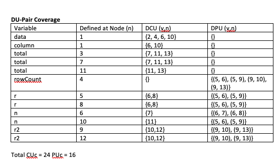
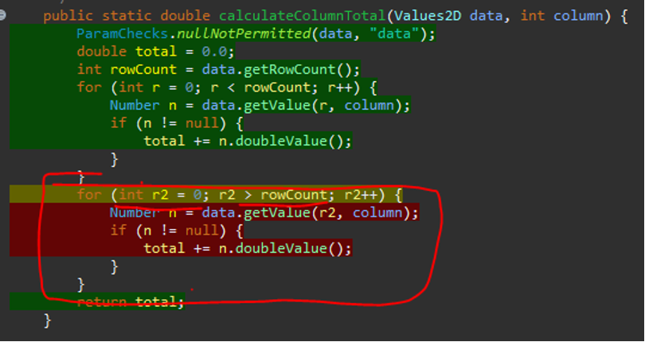
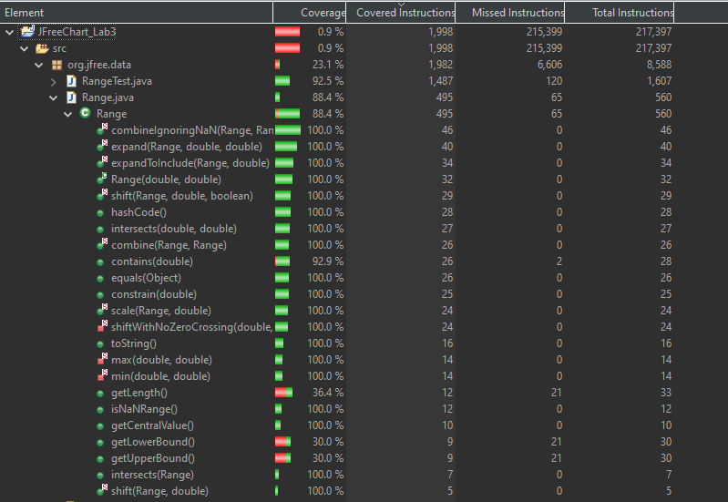

**SENG 637 - Dependability and Reliability of Software Systems**

**Lab. Report #3 – Code Coverage, Adequacy Criteria and Test Case Correlation**

| Group \#:11      |     |
| -------------- | --- |
| Student Names: |     |
|Ameen                |     |
|Mohammad                |     |
|Md Rakin                |     |
|Kunj               |     |
|Saif                |     |

(Note that some labs require individual reports while others require one report
for each group. Please see each lab document for details.)

# 1 Introduction

In this assignment, we build on blackbox testing of Assignment 2 in understanding and performing white-box testing using JUnit in Eclipse. First, using the recommended EclEmma coverage tool, we further our testing of what was covered in Assignment 2. 

# 2 Manual data-flow coverage calculations for X and Y methods

### `DataUtilities.calculateColumnTotal()` 

#### Defs/Uses/DU-pairs

#### DU-pair coverage calculations

#### DU-Pair coverage 

### `Range.contains()` 

#### Defs/Uses/DU-pairs

#### DU-pair coverage calculations

Total CU = 0 PU = 7
#### DU-Pair coverage 

All-uses coverage = (CUc + PUc) / [ (CU + PU) - (CUf + PUf) ] = 100%

# 3 A detailed description of the testing strategy for the new unit test

We use Control Flow Graphs, or CFGs, to visualize possible test cases from Assignment 2. 

#### calculateColumnTotal 

#### calculateRowTotal 

#### createNumberArray

#### createNumberArray2D

#### constrain

#### contains

# 4 A high level description of five selected test cases you have designed using coverage information, and how they have increased code coverage

#### 4.1 DataUtilTest.CalculateColumnTotal_InternalNull 

This test case was used to improve the coverage of the CalculateColumnTotal(Values2D, int) method. The initial test coverage for the method was:
|  |Required Coverage	| Actual Coverage|
|---    |----   |----| 
|Instruction|	90.0 % |	72.9% |
|Branch|	70.0 %	| 50.0 %|
|Method	| 60.0 %	| 100% |

The test coverage did not meet the minimum requirements. However, we decided to improve on the branch coverage. 

This is the coverage for the function before adding the test case.
After adding a new test case, the code is given below:

|  |Required Coverage	| Actual Coverage|
|---    |----   |----| 
|Instruction|	90.0 % |	72.9% |
|Branch|	70.0 %	| 62.5 %|
|Method	| 60.0 %	| 100% |

We could not cover the calculate column total because the row count can't be less than 0, making the for loop inaccessible.

#### 4.2 DataUtilTest.CalculateRowTotal_InternalNull 

This test case was used to improve the coverage of the CalculateRowTotal(Values2D, int) method. The initial test coverage for the method was:

|  |Required Coverage	| Actual Coverage|
|---    |----   |----| 
|Instruction|	90.0 % |	72.9% |
|Branch|	70.0 %	| 50.0 %|
|Method	| 60.0 %	| 100% |

The test coverage did not meet the minimum requirements. However, we decided to improve on the branch coverage. 
After adding a new test case, the code is given below:

|  |Required Coverage	| Actual Coverage|
|---    |----   |----| 
|Instruction|	90.0 % |	72.9% |
|Branch|	70.0 %	| 62.5 %|
|Method	| 60.0 %	| 100% |

We could not cover the calculate row total because the column count can't be less than 0, making the for loop inaccessible. 

#### 4.3 RangeTest.Lower_MoreThan_Upper() 

This test case was used to improve the coverage of the Range Class Constructor. The initial test coverage for the method was:

|  |Required Coverage	| Actual Coverage|
|---    |----   |----| 
|Instruction|	90.0 % |	40.6% |
|Branch|	70.0 %	| 50 %|
|Method	| 60.0 %	| 100% |

The test coverage did not meet the minimum requirements. However, we decided to improve the branch and Instruction coverage. 
After adding a new test case, the code is given below:

|  |Required Coverage	| Actual Coverage|
|---    |----   |----| 
|Instruction|	90.0 % |	100% |
|Branch|	70.0 %	| 100 %|
|Method	| 60.0 %	| 100% |

And Now as we can see adding it made it achieve the minimum requirements

# 5 A detailed report of the coverage achieved of each class and method (a screen shot from the code cover results in green and red color would suffice)

#### DataUtilities branch coverage

#### DataUtilities method coverage

#### Range branch coverage

#### Range instructions coverage

#### Range method coverage

# 6 Pros and Cons of coverage tools used and Metrics you report

In this assignment, we selected EclEmma as our Java code coverage tool, mainly because it was recommended. Integrated seamlessly with Eclipse, EclEmma offers a convenient and efficient way to analyze code coverage directly from the development environment. This integration is pivotal for its appeal, enabling rapid development cycles by allowing immediate coverage analysis right from the Eclipse workbench. The tool's ability to deliver comprehensive coverage results without requiring modifications to the project or extensive setup processes stands out as a significant advantage.

EclEmma provided us with valuable insights through the three statement, branch, and method coverages metrics. One of the tool's strengths lies in its widespread adoption among our team members, which facilitated a smooth transition to using it for control flow coverage analysis. Its support for method coverage metrics is particularly noteworthy, as it guarantees that all methods and functions are tested at least once, enhancing the thoroughness of our testing process.

However, EclEmma is not without its limitations. Its lack of support for condition coverage emerges as a notable drawback. Condition coverage is essential for ensuring that all Boolean expressions are evaluated independently at least once during testing, a metric crucial for comprehensive code analysis. This gap in capability means that EclEmma might not be the optimal choice for projects where condition coverage is a priority.

# 7 A comparison on the advantages and disadvantages of requirements-based test generation and coverage-based test generation.

### Requirements-Based Test Generation:
#### Advantages:
- Tests both functional and non-functional requirements, ensuring the software aligns with its intended purpose and meets stakeholders' expectations.
- Identifies defects early in the development process, reducing the time and cost associated with later fixes.
- Eliminates bias in test case design, as tests are derived from requirements rather than the code itself.
- Enhances communication among team members by fostering a clear understanding and documentation of requirements, which facilitates collaboration between developers, testers, and stakeholders.
- Directly aligns testing with stakeholder expectations and business objectives, potentially increasing stakeholder satisfaction with the final product.

#### Disadvantages:
- Incomplete or ambiguous requirements can lead to insufficient test coverage, missing critical scenarios.
- Tends to overlook scenarios not explicitly mentioned in the requirements, potentially missing edge cases and unintended interactions.
- Relies heavily on the tester's interpretation of requirements, making it susceptible to human error.
- May struggle to adapt to changing requirements in agile development environments, where requirements can evolve frequently.
- Heavily depends on the quality of the requirements documentation, which can be a bottleneck if the documentation is poor or outdated.

### Coverage-Based Test Generation:
#### Advantages:
- Aims for exhaustive code coverage, including statement, branch, and method coverage, to uncover hidden defects.
- Facilitates automation, integrating well with continuous integration systems for regular testing cycles.
- Offers a viable testing strategy in the absence of detailed requirements or specifications, ensuring baseline code quality.
- Provides quantifiable metrics that can be used to gauge the progress of testing efforts and set tangible goals for improvement.
- Particularly useful in identifying regressions or unintended side effects of changes in the codebase, ensuring that previously tested and working parts remain reliable after updates.

#### Disadvantages:
- May not focus on the software's functional correctness or behavior, leading to tests that cover code but miss business logic errors.
- Code coverage metrics, while useful, do not confirm that all input combinations and scenarios have been tested, potentially leaving gaps in test coverage.
- The focus on achieving high coverage metrics can sometimes lead to a quantity-over-quality approach, where testers write many superficial tests rather than fewer, more meaningful tests.
- High coverage numbers can create a false sense of security, leading to complacency and the assumption that high coverage equates to high quality, which is not always the case.

# 8 A discussion on how the team work/effort was divided and managed

Last assignment we split it such that each member was able to do a test from each "Range" and "DataUtilities" from JFreeChart. We followed suit in this assignment for drawing out the various graphs and analyzing DU-pairs. However, as mentioned in the following section 9, we faced difficulties in keeping track of all the calculations so everybody got the opportunity to chime in and review each others work together to ensure things were on track.

Split tests so that each group member worked on one Range method and one DataUtilities method and got exposure to testing methods from both classes.

For Range,team member worked with one of the following functions:
* ( contains(double value) ) – Saif
* ( constrain(double value) ) – Kunj
* ( intersects(double b0, double b1) ) – Ameen
* ( expandToInclude(Range range, double value) ) – Md Rakin
* ( shift(Range base, double delta, boolean allowZeroCrossing) ) – Mohammad

For DataUtilities, team member worked with one of the following functions:
 * ( clone(double[][] source) ) – Saif
 * ( calculateColumnTotal(Values2D data, int column) ) – Kunj
 * ( calculateColumnTotal(Values2D data, int column,int[] validRows) ) – Ameen
 * ( calculateRowTotal(Values2D data, int row) ) – Md Rakin
 * ( calculateRowTotal(Values2D data, int row,int[] validCols) ) – Mohammad

# 9 Any difficulties encountered, challenges overcome, and lessons learned from performing the lab

In manual coverage testing, we found it cumbersome keeping track of all the various values present and staying aligned in our calculations. 

We learned calculating manually DU-pair coverage which helped understanding data-flow coverage. 

# 10 Comments/feedback on the lab itself

The lab helped us figure out gaps in our understanding of software testing by way of learning data-flow coverage and how tools, such as Eclemma are used. 
